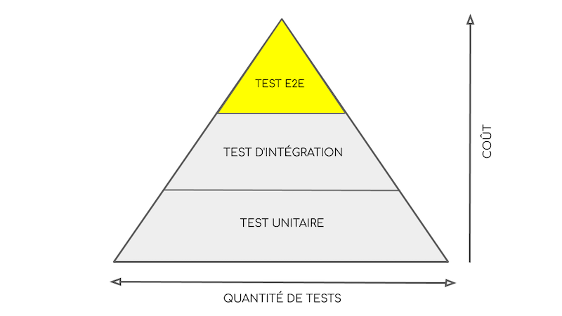

# Is the test pyramid still valid ? 

## Concept

Based on this concept, developers should write more unit tests than e2e tests.

Why ? 

`e2e tests are fragile, slow to run and complex to write`

`unittests are faster to run, easier to write, find and debug`

## Problems with the test pyramid

Downsides of writing too many unittests : 

- may have to setup complex mocks
- may end up with more tests code than production code
- refactoring code can lead to a rework of the unit tests

=> choose wisely what to test

ex : algorithm, interface used by other teams

Are e2e tests really slow ?

Nowadays, it's possible to run e2e tests in parallel. 

e2e slowness is no longer an issue, and should not prevent teams from leveraging on e2e. 
As they are loosely coupled to the implementation, interface between internal functions in the system can change, without having to rewrite the test. 

## What testing strategy to adopt ? 

Does not matter. 

A good test reflects the usage of the product.

What's important is to understand why we are testing.